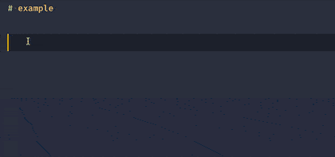
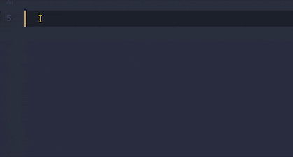
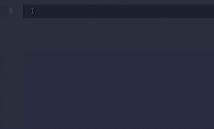
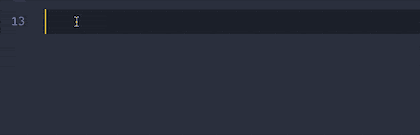
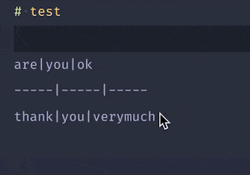
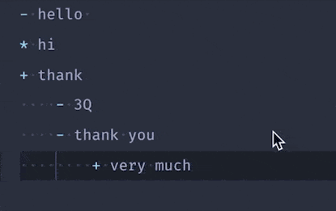
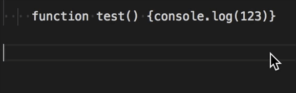

# markdown-formatter

[English Document](./README.md)

## 介绍

这是个提高markdown写作效率的工具, 不仅为 `markdown` 使用者提供了相对统一的格式, 并且提供了一些快捷功能. 

## 使用手册

安装完成以后, 你可能需要重新启动你的vscode. 

在任何 `.md` 为后缀的 `markdown` 标准文件中, 都可以使用 `shift+option+f` (osx) 或者 `ctrl+shift+f` (window) 快速格式化代码. 


> 它并不会修复你的 `markdown` 语法错误, 例如作为标题, `#` 后没有加空格, 这是因为在代码中#是一个可用字符, 广泛得用作注释或变量声明. 

## 功能

### 代码段部分

**必须在`settings.json`中进行如下配置，才可以启用提示**

```js
"[markdown]": {
  // 快速补全
  "editor.quickSuggestions": {
    "other": true,
    "comments": true,
    "strings": true
  },
}
```

#### 插入图片

键入 `img` 



#### 插入表格

键入 `tab` 



#### 插入代码

键入 `js` , `html` , `css` , `python` , `go` , `java` , or `code` 



#### 插入列表

键入 `ul` 或者 `ol` 



### 格式化部分

#### 标点符号

* `，,。;；！、？：` 这些符号后添加一个空格; 
* `，：；！“”‘’（）？。` , 转换为半角符(可选); 
* 支持根据上下文将中文后的符号转换为全角符号, 或者将英文后的转化为半角符; 
* `.!?` 后如果是大写的英文字母或者中文会添加一个空格; 
* 反逗号前后空一格, 反逗号内的内容不会被格式化; 

#### 空行

* 标题上下空出一行; 
* 代码块上下空出一行; 
* 为引用上下空出一行; 
* 相邻的空行合并; 

#### 表格

表格自动对齐



#### 列表

##### 无序列表符号格式化

将 `*` , `+` , `-` 按照层级关系标记

``` markdown

* 大标题
    + 中标题
        - 小标题

```



#### 代码格式化

* 依据配置会格式化文章中的代码, 使用 `js-beautify` 工具, 目前只有 `javascript` , `html` 和 `css` 语言; 

##### 代码块

    ``` lang
    function sayHello() {console.log('hello')}
    ```

1. 如果 `lang` 为 `js` 或者 `javascript` 或者为空, 会按照js语法格式化 
2. 如果 `lang` 为 `html` , 会按照html语法格式化. 
3. 如果 `lang` 为 `css` , 会按照css语法格式化. 
4. 如果你很少写入js代码, *你可以通过配置参数 `formatOpt` 为false来禁止代码块和代码区的自动格式化代码*. 

> 可以通过配置参数 `formatOpt` 更改js格式化规则, 参照[js-beautify](https://github.com/beautify-web/js-beautify).

> 代码块可以清晰标记出语言的类型，因此推荐使用代码块，可以配置 `codeAreaToBlock` 来设置转换方式

##### 代码区

默认是不格式化的, 如果 `codeAreaToBlock` 为任意语言名,如`js`或者`go`, 会被转换成代码块,然后格式化.



**注意: 代码区里的空行不能超过一行**

## 配置

```typescript
// 是否启用格式化
enable = config.get <boolean> ('enable', true); 
// 将配置里的全角符号转化为半角符号, 例如 `，：；！“”‘’（）？。` 
// 当设置为 'auto' 的时候, 自动根据上下文转换符号
// 当设置为 '_' 或者 '' 的时候, 不转换符号
fullWidthTurnHalfWidth = config.get<string>('fullWidthTurnHalfWidth', 'auto'); 
// 转换代码块为代码区，默认为''（空字符）,不转换
// 可以设置为任意合法英文
// 只有设置成js或者javascript，才会按照js语言语法格式化
codeAreaToBlock = config.get<string>('codeAreaToBlock', '');
// 是否格式化代码或者配置js-beautify
// false: 不格式化代码
// {}: beautifyjs的配置设置
formatOpt = config.get<any> ('formatOpt', {}); 
// 格式化无序列表的符号 
// * > + > -
formatULSymbol = config.get<boolean>('formatULSymbol', true); 
// 全角符号后是否需要空格
spaceAfterFullWidth = config.get<boolean>('spaceAfterFullWidth', false); 
```

配置 `js-beautify` , 可以参考[这里](https://github.com/beautify-web/js-beautify)

### 配置示例

你可以参考我的配置: 

```js
// settings.json
// markdown-formatter conf
// 按照js格式化
// "markdownFormatter.codeAreaToBlock": "js",
// 不格式化
"markdownFormatter.codeAreaToBlock": "",
// 自动格式化标点
"markdownFormatter.fullWidthTurnHalfWidth": "auto",
// 中文标点格式化为英文
// "markdownFormatter.fullWidthTurnHalfWidth": "，：；！“”‘’（）？。",
"markdownFormatter.formatOpt": {
  "indent_size": 2
},
"[markdown]": {
  // 自动保存
  "editor.formatOnSave": true,
  // 显示空格
  "editor.renderWhitespace": "all",
  // 快速补全
  "editor.quickSuggestions": {
    "other": true,
    "comments": true,
    "strings": true
  },
  // snippet 提示优先
  "editor.snippetSuggestions": "top",
  "editor.tabCompletion": "on",
  // 使用enter 接受提示
  "editor.acceptSuggestionOnEnter": "on",
  // 默认格式化工具为本工具
  "editor.defaultFormatter": "mervin.markdown-formatter"
}
```

## 开发环境

### 开发版本

VSCode 版本 1.29.1 (macOS Mojave)

### 测试版本

VSCode 版本 1.33.1 (macOS Mojave)

## 联系

如果你有任何想法, 请联系我. 

如果你知道如何使用前端库格式化其他语言, 欢迎告诉我. 

email: mydiamervin@gmail.com 或者 [这里](https://github.com/sumnow/markdown-formatter/issues)

## 鸣谢

感谢大家帮助我完善这个工具

* [lancerXXXX](https://github.com/lancerXXXX)
  + Bug(https://github.com/sumnow/markdown-formatter/issues/16)
* [rgeorgiev583](https://github.com/rgeorgiev583)
  + Bug(https://github.com/sumnow/markdown-formatter/issues/14)
* [Ardeshir81](https://github.com/Ardeshir81)
  + Bug(https://github.com/sumnow/markdown-formatter/issues/13)
* [busyrat](https://github.com/busyrat) 
  + Feature(https://github.com/sumnow/markdown-formatter/issues/10)
* [lartpang](https://github.com/lartpang) 
  + Bug(https://github.com/sumnow/markdown-formatter/issues/15)
  + Feature(https://github.com/sumnow/markdown-formatter/issues/11)
  + Bug(https://github.com/sumnow/markdown-formatter/issues/9)
  + Bug(https://github.com/sumnow/markdown-formatter/issues/8)
  + Bug(https://github.com/sumnow/markdown-formatter/issues/7)
  + Bug(https://github.com/sumnow/markdown-formatter/issues/6)
  + Bug(https://github.com/sumnow/markdown-formatter/issues/5)
* [iostalks](https://github.com/iostalks)
  + Feature(https://github.com/sumnow/markdown-formatter/issues/3)
* [zhuoyan](https://github.com/zhuoyan)
  + Bug(https://github.com/sumnow/markdown-formatter/issues/1)


> 排序仅按照提出问题的时间倒叙排列